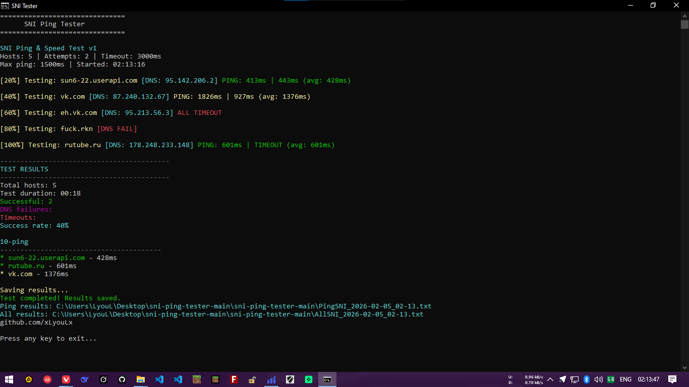

# SNI Ping & Speed Tester

Этот скрипт на PowerShell предназначен для тестирования пинга и скорости скачивания/загрузки для хостов с использованием SNI (Server Name Indication). Хосты берутся из файла `whitelist.txt`. Полезен для проверки доступности и производительности серверов, особенно в сетях с ограничениями или блокировками.

## Описание

Скрипт имитирует пинг через HTTP GET-запросы (чтобы обойти возможные блокировки ICMP или TCP), а также измеряет скорость скачивания, пробуя разные эндпоинты (например, favicon.ico, robots.txt). Для мелких файлов запросы повторяются, чтобы получить более точную оценку скорости. Если скорость не удалось измерить напрямую, используется приблизительная оценка на основе пинга (это не идеально, но лучше, чем ничего).

## Расширенное использование: SNI-спуфинг в VLESS/Trojan + Reality

Домены и поддомены из `whitelist.txt` можно использовать для SNI-спуфинга в протоколах VLESS или Trojan с Reality. Это позволяет маскировать трафик под подключение к разрешённым сервисам, потенциально обходя сетевые ограничения. Однако эффективность зависит от типа блокировок (SNI или IP/CIDR). Рекомендуется тестировать в вашей среде.

## Установка

1. Скачайте репозиторий целиком (включая скрипт `SNITEST.ps1`, `whitelist.txt`, `start.bat` и `image.png`).
2. Убедитесь, что PowerShell установлен (доступен на Windows, Linux и macOS).
3. Для Linux: Установите PowerShell через пакетный менеджер, например, `sudo apt update && sudo apt install powershell` (для Ubuntu).
4. Для macOS: Установите через Homebrew — `brew install --cask powershell`.
5. Запустите скрипт через `start.bat` (двойной клик на Windows или `./start.bat` на других ОС) или напрямую: `.\SNITEST.ps1`. На Windows может потребоваться установка политики выполнения: `Set-ExecutionPolicy RemoteSigned`.

Скрипт не требует дополнительных зависимостей.

## Использование

- Отредактируйте `whitelist.txt`, если нужно (один хост на строку).
- Запустите скрипт.
- Результаты сохраняются в файлы с временной меткой: `PingSNI_*.txt` (пинги), `SpeedSNI_*.txt` (скорости), `AllSNI_*.txt` (всё вместе). Логи ошибок — в `Errors_*.txt` (если включено).
- В консоли отображается прогресс, сводка и топ-10 по пингу/скорости.

## Конфигурация

В начале скрипта можно настроить параметры:
- `$maxPing = 1500`: Максимальный допустимый пинг в мс для подсчёта успешных хостов.
- `$pingAttempts = 2`: Количество попыток пинга на хост (больше — точнее, но медленнее).
- `$timeoutMs = 3000`: Таймаут запроса в мс.
- `$testSpeed = $true`: Включить тест скорости (false — для ускорения).
- `$testPing = $true`: Включить тест пинга.
- `$maxDownloads = 20`: Максимум повторений скачивания для мелких файлов.
- `$savePingResults = $true`: Сохранять результаты пинга.
- `$saveSpeedResults = $true`: Сохранять результаты скорости.
- `$saveAllResults = $true`: Сохранять общий файл.
- `$saveErrorLog = $false`: Сохранять логи ошибок.
